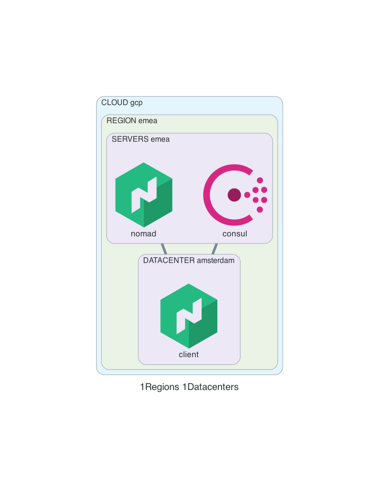

# nomad-aws
Nomad cluster following [nomad architecture reference](https://learn.hashicorp.com/tutorials/nomad/production-reference-architecture-vm-with-consul?in=nomad/enterprise)

## Diagram


## How to use this repo
- Clone this repo
```
git clone https://github.com/ion-onboarding/nomad-aws.git
```

- change directory
```
cd nomad-aws
```

## Create infrastructure
- initialize working directory
```
terraform init
```

- plan, to see what resources will be create
```
terraform plan
```

- create resources
```
terraform apply
```

## Destroy infrastructure
- destroy resources
```
terraform destroy
```

## How to connect?
- use terraform output to get the SSH details
```
terraform output
```
